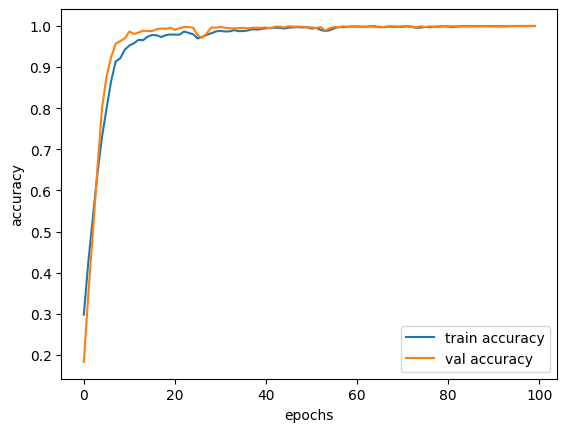
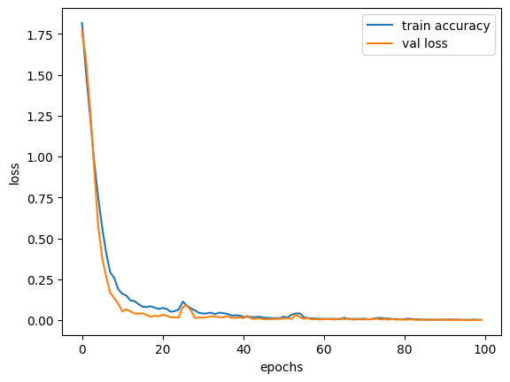

# Speech Emotion Recognition

A speech emotion recognition project that uses **MFCC (Mel-Frequency Cepstral Coefficients)** features and an **LSTM neural network** to classify speech recordings into different emotion categories.

## Project Overview

Speech Emotion Recognition (SER) is a machine learning task that identifies emotional information from speech signals.

This project uses the **Toronto Emotional Speech Set (TESS)** dataset and extracts MFCC features from audio recordings. These features are then given to an LSTM-based neural network for emotion classification.

## Emotions
``
The model classifies speech into 7 emotion categories:

* Angry
* Disgust
* Fear
* Happy
* Neutral
* Pleasant Surprise
* Sad

## Methodology

The overall workflow is:

```text
Audio Speech
     ↓
Audio Preprocessing
     ↓
MFCC Feature Extraction
     ↓
LSTM Neural Network
     ↓
Dense Layers
     ↓
Softmax Classification
     ↓
Predicted Emotion
```

## Feature Extraction

The project uses **Librosa** for audio processing and MFCC extraction.

The implemented feature extraction process:

* Loads the audio using Librosa
* Uses a 3-second audio duration
* Starts processing from a 0.5-second offset
* Extracts **40 MFCC features**
* Takes the mean of the MFCC values across time

## Model Architecture

The implemented neural network uses an LSTM followed by fully connected layers:

```text
Input: 40 MFCC features
        ↓
LSTM (123 units)
        ↓
Dense (64 units, ReLU)
        ↓
Dropout (0.2)
        ↓
Dense (32 units, ReLU)
        ↓
Dropout (0.2)
        ↓
Dense (7 units, Softmax)
```

The model contains **71,747 trainable parameters**.

## Training

The model is implemented using **TensorFlow/Keras**.

Training configuration used in the notebook:

* Optimizer: Adam
* Loss function: Categorical Crossentropy
* Batch size: 512
* Epochs: 100
* Validation split: 20%

## Results

The project report documents an evaluation accuracy of **84.81%**.

The notebook also includes training and validation accuracy/loss plots and an example prediction on a new audio file.

> **Note:** The notebook uses a validation split rather than a separate independent test dataset. Therefore, the validation accuracy shown during notebook training should not be presented as independent test accuracy.

## Technologies Used

* Python
* TensorFlow
* Keras
* Librosa
* NumPy
* Pandas
* Scikit-learn
* Matplotlib
* Seaborn
* Jupyter Notebook

## Dataset

The project uses the **Toronto Emotional Speech Set (TESS)**.

The audio dataset is not included in this repository. Users should obtain the dataset separately and configure the local dataset path before running the notebook.

## Project Structure

```text
speech-emotion-recognition/
│
├── README.md
├── IDP (2).ipynb
│
└── data/
    └── README.md
```

## Future Improvements

Possible improvements include:

* Using a separate independent test dataset
* Evaluating precision, recall, and F1-score
* Generating a confusion matrix
* Improving generalization to unseen speakers
* Experimenting with additional audio features
* Comparing different neural network architectures

## Project Status

Completed academic project / minor project.

## Results

### Accuracy



### Loss


